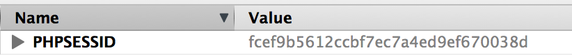

03 - Web Programming
===============
>Now that we are comfortable with strings, functions and arrays we will dive right into understanding how PHP can be used to build web applications. 
>Although now PHP has evolved into a language that can do more than just build the web, it was originally designed as a web development language. 
>This week, we will look at how easy it is to build a page, style it, create a form, collect user input and persist state using sessions.

***

#### HTML
Hyper Text Markup Language is the language used to design and represent every website you see on the internet today, regardless of the back end language used to generate it.

A HTML document has the following features
```html
<!DOCTYPE html>
<html>
<head>
    <!-- This is where your JS and CSS references go -->
    <style type="text/css">
        body {
            font-family: verdana;
        }

        .inputbox {
            font-size: 1.2em;
            color: orange;
        }
    </style>

    <script type="text/javascript" language="javascript">

        /**
         * When a user clicks the button, this function gets called
         */
        function myClickFunction() {

            var person_name = document.getElementById('pname').value;

            // If they didn't enter a name, show an error message
            if (person_name == "") {
                alert('Please enter a person name');
            } else {
                alert('You entered ' + person_name);
            }
        }
    </script>
</head>
<body>

<h3>HTML is cool</h3>

Enter Name: <input type="text" name="person_name" id="pname" size="20" class="inputbox"/>

<br/> <!-- This is a HTML comment -->

<input type="button" value="Click Me" onclick="myClickFunction();" class="inputbox"/>
</body>
</html>
```

Code between the ```<style type="text/css">``` and ```</style>``` tags is ```CSS```, and is used to style elements on a page. 
The code between ```<script type="text/javascript" language="javascript">``` and ```</script>``` is called ```javascript``` and is used to add incredibly powerful dynamic functionality to your web application. 
Learning javascript is essential to becoming a successful web applications developer. 

Markup between the ```<body>``` and ```</body>``` tags is the content of the page 
and usually is a combination of text, images and form controls all styled by ```CSS``` and brought to life using ```javascript```.
 

You can attach an event to a button, or any other element on the page for that matter, and run a custom javascript function when the event fires. 
In this case we have created a function called ```myClickFunction()``` that gets called when the user clicks the button. 
This works because the function is attached to the ```onclick``` event for that particular button.  

#### Scaffolding using bootstrap
[Bootstrap](http://getbootstrap.com/) is a CSS and javascript library that is used to create responsive layouts effortlessly. 
When you build a modern website, it should be able to scale to different screen resolutions. Bootstrap provides you with this functionality out of the box. 
We will also be using bootstrap to style tables, buttons, images, text, widgets etc...
 
#### Adding style using CSS
As we mentioned earlier, ```CSS``` is a language in and of itself, used to style elements on a page. 
Separating style from markup is the hallmark of a maintainable, easy to read, extensible and well written application

#### Dynamic behavior using the power of javascript and jQuery
[jQuery](http://jquery.com/) is a ```javascript``` library used to speed up your ability to interact with the [DOM](http://en.wikipedia.org/wiki/Document_Object_Model) using javascript. 
Going back to our original example, we stored the value of person name in a variable called person_name like so ```var person_name = document.getElementById('pname').value;``` 
The way you can do the same thing in jQuery is ```var person_name = $("#pname").val();```. jQuery makes it incredibly easy to select elements using selectors, loop over a list of items, apply styles, make AJAX calls and much much more.

#### Collecting user input using forms
Any modern web application needs to collect user data in some structured way. This is typically accomplished using web forms. 

A form consists of elements and is enclosed in a ```<form>``` tag:
```html
<form name="collectDataForm" action="http://example.com/process_form.php" method="post">
</form>
```

All the ```input``` types on your form are indicative of the kind of data you are interested in collecting.

To collect:

##### A single line of text use ```text``` 
```html
<input type="text" name="leaderName" size="30" value="Gandhi" placeholder="Enter Name"/>
```

##### Multiple lines of text use ```textarea```
```html
<textarea name="lifeStory" rows="5" cols="30" placeholder="Enter Life Story"></textarea>
```

##### Mutually exclusive values use ```radio``` 
Notice how the name="yesOrNo" is the same for both radios. This is how you link the radio buttons together
```html
<input type="radio" name="yesOrNo" value="Yes"/> Yes 
<input type="radio" name="yesOrNo" value="No"/> No
```

##### Mutually inclusive values use ```checkbox```
```html
<input type="checkbox" name="coursesTaken[]" value="PHP"/> PHP
<input type="checkbox" name="coursesTaken[]" value="MySQL"/> MySQL
<input type="checkbox" name="coursesTaken[]" value="Python"/> Python
```

##### A single value from a list of many use ```select```
```html
<select name="animals">
  <option value="Human">Human</option>
  <option value="Monkey">Monkey</option>
  <option value="Goat">Goat</option>
  <option value="Whale">Whale</option>
</select>
```

##### A file use
```html
<input type="file" name="myFile"/>
```
Additionally, in the ```<form>``` you will need to add ```enctype="multipart/form-data""``` to indicate that the form will be posting a file


#### Making AJAX calls
AJAX is a way we can make a call to the server, with a specific request, and get back a specific response, without reloading the page. 
With the data that we get back from the server, we can update certain pieces of the page. 
All modern web applications leverage some sort of AJAX mechanism to make the application feel more responsive.
 
Lets take a look at how we an make an AJAX call with jQuery.
```javascript
$.ajax({
    url: "/get_data", 
    dataType: "json",
    data: {
        action : 'get_scores',
        student : 'Samir Patel'
    }, 
    success: function(jsonData) {
        response(jsonData.results);
    }
});
```
The reason why you would want to use jQuery over plain javascript to do this is that in plain javascript you would need to account for cross 
browser differences, with jQuery you don't.

#### Sessions
HTTP is a stateless protocol. Every time you make a request to a web server, the server has no memory of who you are or who you were. 
Sessions aim to alleviate this problem by creating a session cookie locally. Once your session is established, i.e. the cookie is created, every subsequent request you make, 
will contain that cookie in the header that uniquely identifies you. Sessions are typically used to store small amounts of data on a user. 
Lets take a look at a typical use case for a session, a login box. 
```php
<?php
session_start();

// A form was posted
if (!empty($_POST)) {
    $username = $_POST['username'];
    $_SESSION['username'] = $username;
    $_SESSION['logged_in'] = 1;
}
?>

<?php
if (isset($_SESSION['logged_in'])) {
    echo 'Welcome to the member\'s area '.$_SESSION['username'];
} else {

    ?>
    <form name="loginForm" action="<?php echo($_SERVER['PHP_SELF']); ?>" method="post">
        Username: <input type="text" name="username" size="12"/>
        <input type="submit" value="Login"/>
    </form>
<?php
}
?>
```

The method ```session_start()``` needs to get called prior to using ```$_SESSION```. PHP will then send out a session cookie to your local browser called ```PHPSESSID```. 

This cookie will be sent back to the server with every request to identify this session as being yours. You don't have to worry about the details of how the session works, only how to use it. 
Using the session is as simple as assigning or retrieving a value to the ```$_SESSION``` super global.