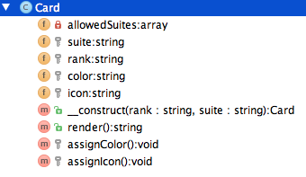
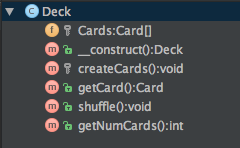
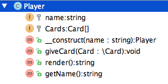

04 - Object Oriented Programming
===============
>PHP5 is an enterprise grade object oriented programming language. This week, we will be looking at how to build classes
that we will use to instantiate objects.
>OOP is the most important programming paradigm you will ever learn. 
Most maintainable, large scale projects leverage the power of classes and objects and employ design patterns.
>These concepts come bundled with a learning curve, since most of the code we have looked at this far has been procedural. 
>Please study this material diligently and ask lots of questions! 
>Most, if not all, programming jobs these days expect developers to be fluent in OOP concepts.

***

OOP Fundamentals
----------------
Classes are an organized group of properties (variables) and methods (functions). This grouping of data and functionality is known as **encapsulation**.
Writing code in this way gives us the ability to create a system that is composed of discrete pieces that are isolated from one another
and can only communicate with each other via messages.
Classes cannot be used directly, they have to be instantiated into objects, or their methods can be called statically.
Lets take a look at how we can create classes and instantiate objects from them.

#### Defining a class
```php
<?php

class Person
{
    /**
     * Person's numeric identifier (generated by the database)
     *
     * @var int
     */
    protected $id;

    /**
     * Person's first and last name
     *
     * @var string
     */
    protected $name;

    /**
     * Person's billing address.
     *
     * @note  I should have named this property billingAddress for clarity
     *        The reason why I didn't is to illustrate the importance of documenting!
     *        If I would not have documented this, you would have to go through the code to figure it out.
     * @var string
     */
    protected $address;

    /**
     * Create a new person
     * @param int $id Primary key aca_user.user_id
     * @param string $name Full name
     * @param string $address Billing address
     */
    public function __construct($id, $name, $address)
    {
        $this->id = $id;
        $this->name = $name;
        $this->address = $address;
    }

    /**
     * @return string
     */
    public function getAddress()
    {
        return $this->address;
    }

    /**
     * @return int
     */
    public function getId()
    {
        return $this->id;
    }

    /**
     * @return string
     */
    public function getName()
    {
        return $this->name;
    }
}
```

#### Instantiating an object

Now that we have created a person class, lets use it to create a concrete person object.
The object that we are about to create is unique because of the data that we pass to it via constructor arguments.
```php
<?php

$InstructorPerson = new Person(5, 'Samir Patel', '5000 Memory Lane');
print_r($InstructorPerson);
```

The output we get will look something like this. Notice that it tells us that the kind of object we are looking at is ```Person```
The person we are looking at here is really an instructor.
```
Person Object
(
    [id:protected] => 5
    [name:protected] => Samir Patel
    [address:protected] => 5000 Memory Lane
)
```
Instructor's teach several courses, but don't take any courses. ```Student```s take courses, but don't teach any.
We could add two ```array``` properties to the ```Person``` class and call them ```$coursesTaught``` and ```$coursesTaken```.
This solution is far from ideal, because now every time we create an instructor, we will have ```$coursesTaken``` property and when we
create a student, we will have an extra property for ```$coursesTaught```, even though these properties belong to the instructor and student respectively.
We will be using *Inheritance*, a staple of object oriented design, to solve this classic problem.

#### Inheritance
Inheritance allows you to extend a parent class and add functionality to it, and/or override any existing functionality it contains.
We will create two classes ```Instructor``` and ```Student``` and add the aforementioned properties to each one.
```php
<?php

class Student extends Person
{
    /**
     * An array of all courses that this student has taken
     *
     * @var array
     */
    protected $coursesTaken = array();

    /**
     * Add a course to the list of courses this student is taking
     *
     * @param string $courseName Name of the course this student is taking
     * @return Student
     */
    public function addCourse($courseName)
    {
        $this->coursesTaken[] = $courseName;
        return $this;
    }
}

class Instructor extends Person
{
    /**
     * List of course names this instructor is teaching
     *
     * @var array
     */
    protected $coursesTaught = array();

    /**
     * Add a course to the array of courses this instructor is teaching
     *
     * @param string $courseName Name of the course this instructor is teaching
     * @return Instructor
     */
    public function addCourse($courseName)
    {
        $this->coursesTaught[] = $courseName;
        return $this;
    }
}
```
Create a student, and pile on a heavy course load.
```php
<?php

$IndustriousStudent = new Student(123, 'Albert Einstein', 'Munich, Germany');

// You can chain methods like this because you returned $this in your addCourse() method
// $this is pseudo variable that is an internal reference to the current object you are accessing or mutating
$IndustriousStudent->addCourse('Advanced Python')->addCourse('Advanced PHP');
$IndustriousStudent->addCourse('Particle Physics');
print_r($IndustriousStudent);
```

Notice how the object is now of type ```Student``` not ```Person```.
Also notice how the ```id```, ```name``` and ```address``` properties are inherited from the parent class ```Person```

```
Student Object
(
    [coursesTaken:protected] => Array
        (
            [0] => Advanced Python
            [1] => Advanced PHP
            [2] => Particle Physics
        )

    [id:protected] => 123
    [name:protected] => Albert Einstein
    [address:protected] => Munich, Germany
)
```

Lets create an ```Instructor``` and add some courses they teach
```php
<?php

$ACAInstructor = new Instructor(456, 'Samir Patel', 'Austin TX');
$ACAInstructor->addCourse('Intermediate PHP');
$ACAInstructor->addCourse('Advanced PHP');
$ACAInstructor->addCourse('Golfing like a boss');
print_r($ACAInstructor);
```

Notice how the object is of type ```Instructor``` and has the ```$coursesTaught``` property instead of ```$coursesTaken```
```
Instructor Object
(
    [coursesTaught:protected] => Array
        (
            [0] => Intermediate PHP
            [1] => Advanced PHP
            [2] => Golfing like a boss
        )

    [id:protected] => 456
    [name:protected] => Samir Patel
    [address:protected] => Austin TX
)
```

Classes explained
-----------------

#### Constructors
A constructor looks like this ```___construct()```. A constructor is a way for you to define the arguments the class
will take when you instantiate it. When we say ```$Obj = new MyCoolClass();``` we are *instantiating* the class into an object.

Lets create a simple class called ```Weather```.
Notice that this class has two constructor arguments, ```$temperature``` and ```$location```.
The ```$location``` argument is optional, because it has a default value of *Austin*.
Since it is an optional argument, you don't need to specify the location when you instantiate the class, or you could if you wanted the weather in *Chicago* instead.

```php
<?php

class Weather
{
    /**
     * @param float $temperature Temperature in fahrenheit
     * @param string $location City name
     */
    public function __construct($temperature, $location = 'Austin')
    {
        if ($temperature > 80) {
            echo "It is super hot in $location";
        } else {
            echo "Its really cold in $location";
        }
    }
}
```
Let's instantiate this class in a few different ways, and examine the output.
```php
<?php

$EastWeather = new Weather(88.50, 'Bombay'); // Outputs: It is super hot in Bombay
$NorthWeather = new Weather(60.34, 'Alaska'); // Outputs: Its really cold in Alaska
```

Notice that when we instantiate a class into an object,
the first thing that runs is all the code you have defined in the constructor. 
The instantiated object is now of the same type as the class. 
You can use the ```get_class()``` method to determine the class of the object, 
or you can use the ```instanceof``` operator to check if an object was instantiated from a given class. 

```php
<?php

echo get_class($EastWeather); // Weather

if($EastWeather instanceof Weather){
    echo 'Yep its a Weather object';
}else{
    echo 'Nope its not a Weather object';
}
```

#### Properties: Public, private and protected methods and properties
A method is simply a function inside of a class. A property is a variable inside a class.
PHP has three levels of visibility that apply to methods and properties.

* ```public``` - Anything prefixed with the public keyword can be accessed and mutated from anywhere.
* ```protected``` - This prefix only allows the current class and any child class visibility and mutability.
* ```private``` - Private methods and properties can only be accessed from within the class that they were defined.

The reason why we have the ability to control visibility is so when other developers read our code, it becomes clear to them
what we want them to be able to modify and what is off limits. Lets take a look at an example of how visibility is useful.
Note that if we print out an object, using ```print_r()``` or ```var_dump()``` you will still see the value of the variable.

```php
<?php

class Employee
{
    /**
     * @var string
     */
    protected $name;

    /**
     * Any medical condition this employee has
     *
     * @var string
     */
    private $medicalCondition;

    /**
     * @param string $medicalCondition
     */
    public function setMedicalCondition($medicalCondition)
    {
        $this->medicalCondition = $medicalCondition;
    }

    /**
     * @return string
     */
    public function getMedicalCondition()
    {
        return $this->medicalCondition;
    }

    /**
     * @param string $name
     */
    public function setName($name)
    {
        $this->name = $name;
    }

    /**
     * @return string
     */
    public function getName()
    {
        return $this->name;
    }
}
```
Now that we have created one private property in this class, lets instantiate it and print_r the object.

```php
$Adult = new Employee();
$Adult->setMedicalCondition('The Shakes');
$Adult->setName('John Doe');
print_r($Adult);
```

Here is the output from ```print_r($Adult);```
```php
Employee Object
(
    [name:protected] => John Doe
    [medicalCondition:Employee:private] => The Shakes
)
```

As you can see, even though the property is private, we can still see the data it contains when we print the object.

Lets create a child class, and call it ```ChildEmployee```, and try to access the parent's private property.

```php
<?php

class ChildEmployee extends Employee
{
    /**
     * I can access the parent's medical condition property,
     * because I am calling it via a getter, whose visibility is public.
     */
    public function readMedicalCondition()
    {
        echo 'Medical Condition: ' . $this->getMedicalCondition();
    }

    /**
     * I cannot access a private property from a child class
     */
    public function accessMedicalConditionProperty()
    {
        echo $this->medicalCondition;
    }
}
```

Our new class contains two new methods called ```readMedicalCondition()``` and ```accessMedicalConditionProperty()```.
Lets instantiate the class into an object and call those methods.
```php
<?php

$Child = new ChildEmployee();
$Child->setName('Bonobo');
$Child->setMedicalCondition('Shivers');

// This works
echo 'Read using public getter from parent class: ' . $Child->getMedicalCondition() . "\n";

// So does this
echo 'Read using public getter from child class: ' . $Child->readMedicalCondition() . "\n";

// This does not work
$Child->accessMedicalConditionProperty(); // Notice: Undefined property: ChildEmployee::$medicalCondition
```

The reason why we can read the medical condition with this method is because it is using the parent's ```getMedicalCondition()``` method.

Since the ```getMedicalCondition()``` method in the ```Employee``` class is public, is defined in the parent class and accesses
a private property defined in the same class, we can read the value for medical condition.

When we try to call the ```accessMedicalConditionProperty()``` method it fails because the method is trying to directly access
the private property ```$medicalCondition``` that is defined in the parent ```Employee``` class.

### Class constants
Class constants are defined using the ```const``` keyword, are not prefixed with a ```$``` symbol and are uppercase by convention.
Constants can only contain primitive values like integers, floats and strings.
```php
<?php

class Foo
{
    const BAR = 'fubar';

    const NUM_COUNTRIES_ON_EARTH = 193;

    public function displayConstant()
    {
        echo self::BAR;
    }
}
```

Here is how you would access the constants

```php
$F = new Foo();

// How to access the constant internally
$F->displayConstant();

// How to access the constant from the outside the class
echo 'There are ' . Foo::NUM_COUNTRIES_ON_EARTH .' countries on earth';
```

#### Static Methods and Properties
Static methods start with a visibility modifier and the keyword ```static``` e.g. ```public static function getMoFoo()```.
You do not need to instantiate a class into an object to call static methods, these methods can only be called in the class context.
Similarly, you cannot call a static method from a non static context, e.g. you cannot call the ```getMoFoo()``` method from an instantiated object.
```php
<?php

class StaticClass
{
    /**
     * Get more foo statically :)
     */
    public static function getMoFoo()
    {
        return 'mo foo?';
    }
}
```

This is how you would call the static method.
```php
$fooHolder = StaticClass::getMoFoo();
```

This is how you could access/mutate a static property.
```php
<?php

class StaticTest
{
    /**
     * Static property whose visibility and mutability is public
     *
     * @var string
     */
    public static $myBar = 'Should be raised';
}

// Access the property
echo StaticTest::$myBar . PHP_EOL; // Should be raised

// Mutate the static property
StaticTest::$myBar = 'Handlebar';

// Access the property after mutating
echo StaticTest::$myBar;
```

One very important point to note is that when you set the value of a static property, every subsequent object you
instantiate will take that newly set value into consideration. This is a **very useful** feature.
You can make instantiated objects behave differently by setting up some static switches on your classes and manipulate them at runtime.

An interesting use case for a static property could be to completely alter the context in which classes "do stuff".
Let's take a look at a real world example of a ```DataManager``` class with a ```$cacheEnable``` switch.
```php
<?php

class DataManager
{
    /**
     * Should we cache results?
     *
     * @var bool
     */
    public static $cacheEnable = true;

    /**
     * Get data from cache if switch is set, otherwise get from DB
     *
     * @return string
     */
    public function getData()
    {
        if (self::$cacheEnable == true) {
            return 'Got data from cache';
        } else {
            return 'Got data from database';
        }
    }
}
```

The ```getData()``` method will check the static property by using the ```self``` keyword. The value of ```$cacheEnable```, once set,
will be checked for every new object that is instantiated till the end of the request lifecycle.

```php
<?php

// Statically enable the cache, instantiate object and call non static method
DataManager::$cacheEnable = true;
$Manager = new DataManager();
echo $Manager->getData();

echo PHP_EOL;

// Statically disable the cache, instantiate object and call non static method
DataManager::$cacheEnable = false;
$Manager = new DataManager();
echo $Manager->getData();
```

#### Visibility and Encapsulation

Variables contained within a class are known as properties. Properties can take on three standard visibility prefixes
viz. ```public```, ```protected``` and ```private```. When in an object context, you can access ```public``` properties directly. 
```protected``` properties can only be accessed via children in a class context. 
```private``` properties can only be accessed within the class they were defined in. 
Mutating public properties is very bad programming practice, but you can do it and here's how:

```php
<?php

class SoupOfTheDay
{
    public $soupName = 'Foo Young Soup';
}

$Soup = new SoupOfTheDay();

// Get soup name directly because its public
echo $Soup->soupName;

// Set soup name directly, also because its public
// This is BAD programming practice, don't ever do this,
// unless you have a great reason, and then still don't do it.
$Soup->soupName = 'Foo Old Soup';
```

The reason why mutating public properties is bad is because its breaks [encapsulation](http://en.wikipedia.org/wiki/Encapsulation_(object-oriented_programming)). 
If you wanted someone to change the soup of the day, then you should provide a ```setter``` for client code to do so. You can achieve this effect quite simply.
```php
<?php

class SoupOfTheDay
{
    protected $soupName = 'Foo Young Soup';

    /**
     * @param string $soupName
     */
    public function setSoupName($soupName)
    {
        $this->soupName = $soupName;
    }
}

$Soup = new SoupOfTheDay();
$Soup->setSoupName('Soup-A-Pilla');
```
Setters are important because we have now made it aptly clear to anyone that uses our class that we are giving them permission to mutate the ```$soupName``` property. 
If you just made all your properties public, the client would assume that they could modify anything, at any point in time, and this might not be what you intend.

Remember from our discussion earlier we said that ```private``` properties can only be accessed from the class within which they were defined and
```protected``` properties can only be accessed from within an inheritance hierarchy.

```php
<?php

class GateEstate
{
    /**
     * Said no one ever!
     *
     * @var string
     */
    public $codeComments = 'Windows is just amaaaazing man!';

    /**
     * This makes no sense, lets let our children figure this one out.
     *
     * @var string
     */
    protected $childrenCanSeeThis = 'CallProc32W is insane. It\'s a variadic function that uses';

    /**
     * Windows code comment that only the GateEstate is privy to seeing
     * You can only access this property in the GateEstate class using the $this keyword
     *
     * @var string
     */
    private $windowsCodeComment = 'HACK ALERT, believe it or not there is no way to get the height of the current window';
}

class RJGate extends GateEstate
{
    public function __construct()
    {
        echo 'I can see this public property as well: ' . $this->codeComments;
        echo 'I can see $childrenCanSeeThis: ' . $this->childrenCanSeeThis;

        // Should not be able to access this
        echo 'I cannot access this: ' . $this->windowsCodeComment;
    }
}
```

Encapsulation is the creating of an object that contains both data and functionality and a clear definition of what can and cannot be accessed externally. 
A well defined object should have a clear interface, in that, the client using the class should have a clear understanding of what can and cannot be mutated/accessed.  
When we use ```private``` and ```protected``` methods or properties, we are using *Information Hiding* to hide the guts of our class and only show the parts that we want clients to interact with.

Abstract Classes
----------------
Abstract classes are a blueprint of an actual class that may contain partially implemented functionality
or method definitions that every child class should implement. Lets create an abstract class called ```GetFoo```
```php
<?php

abstract class GetFoo
{
    public function getSomeFoo()
    {
        return 'Some Foo';
    }

    /**
     * By making this method abstract, we are forcing any client class that extends this class to implement this method
     *
     * @return string
     */
    abstract public function getMoreFoo();
}
```

This particular class has one abstract method. Any class that extends this class **must** implement the ```getMoreFoo()``` method.
```GetFoo``` cannot be instantiated into an object because it is abstract.
```php
<?php

//Fatal error: Cannot instantiate abstract class GetFoo
$AbstractFoo = new GetFoo();
```

This is what our child class looks like. We have implemented the ```getMoreFoo()``` method.
From within this method, we can access any parent methods by using the ```parent``` keyword.
```php
<?php

class WantFoo extends GetFoo
{
    /**
     * This method can be called from within this class, and any child that extends it.
     *
     * @return string
     */
    protected function addFoo()
    {
        return 'is good for you.';
    }

    /**
     * We have to implement this method, because the parent method is abstract
     *
     * @return string|void
     */
    public function getMoreFoo()
    {
        // Get some foo from the parent class
        $someFoo = parent::getSomeFoo();

        // Call a protected method from within this class
        $addFoo = $this->addFoo();

        return $someFoo . ' ' . $addFoo;
    }
}
```

And of course this is how we can call these methods.
```php
<?php

$Wufu = new WantFoo();

// We can access the public property in the abstract class because we extended it.
echo $Wufu->getSomeFoo();

// Get more foo, calls parent method and local protected method
echo $Wufu->getMoreFoo();
```

Interfaces
----------
An Interface cannot define any functionality but it can be used to ensure that any class that ```implements``` it, will
implement every method that is specified in the interface. This is useful when you want to make sure a set of interchangeable child classes
always have the same set of methods. Interfaces are widely used in systems whose classes are **polymorphic** i.e. classes that can take on many forms.

Lets say we are asked to build a system that allows user data to be cached. We need to support ```memcache```, ```filesystem``` and ```moneycache``` handlers.
Furthermore, any new client that is added, needs to have a ```get($key)``` and ```set($key, $val)``` method that have the mentioned arguments.

Here is how we define an interface
```php
<?php

interface CacheInterface
{
    /**
     * Get a value from cache
     *
     * @param string $key Key to get from cache
     *
     * @return mixed
     */
    public function get($key);

    /**
     * Set a value to cache
     *
     * @param string $key Cache key
     * @param mixed  $val Value to set
     *
     * @return mixed
     */
    public function set($key, $val);
}
```

Now lets define some classes that implement this interface.

```php
<?php

class MemcacheCache implements CacheInterface
{
    public function get($key)
    {
        return $key . ' from memcache';
    }

    public function set($key, $val)
    {
        return 'set ' . $val . ' to memcache under ' . $key;
    }
}
```
```php
<?php

class FilesystemCache implements CacheInterface
{
    public function get($key)
    {
        return $key . ' from file system cache';
    }

    public function set($key, $val)
    {
        return 'set ' . $val . ' to file system cache under ' . $key;
    }
}
```
```php
<?php

class MoneyCache implements CacheInterface
{
    public function get($key)
    {
        return $key . ' from money cache';
    }

    public function set($key, $val)
    {
        return 'set ' . $val . ' to money cache under ' . $key;
    }
}
```

As you can see, each class ( ```MemcacheCache```, ```FilesystemCache``` and ```MoneyCache``` ) that implements the ```CacheInterface``` interface,
is forced to implement the ```get($key)``` and ```set($key, $val)``` methods with the exact same signature as was defined in the interface.

***

#### Homework 04 - Object Oriented Card Game

[Starter Code](homework/04_OO_card_game.md)

In the second week of class, we wrote some helper functions for our teammates, who were working on a card game.
 
We created the following functions:
- ```getDeck()``` - Returns an array of cards in a deck
- ```shuffleDeck(&$deck)``` - Shuffle a deck of cards
- ```deal($players, $numCards, &$shuffledDeck)``` - Deal a certain number of cards out to each player from the given deck

Now that we have a solid understanding of how classes and objects work, we are being asked to create classes out of this functionality. 

By Creating classes, we will allow for this functionality to be dropped into a wider system with ease,  
make it flexible to test and make it perfectly clear to our client's (colleagues) how our classes are supposed to work.

Here are the classes you are being asked to create:

##### Card
This class represents a single playing card



##### Deck
This class represents a deck of cards. 
It should have the ability to shuffle the deck, and the ability to get one card from the deck.



##### Player
This class represents a player playing this game. The player should have a name, and a hand of Cards



The sample code provides an example of an ```index.php``` file that instantiates the classes into objects and calls the appropriate methods. Please use the starter code as your guide and breathe life into the empty methods