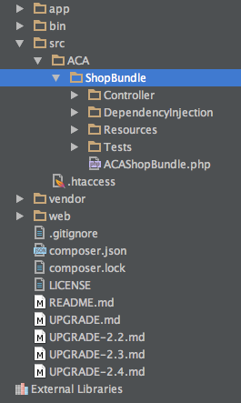
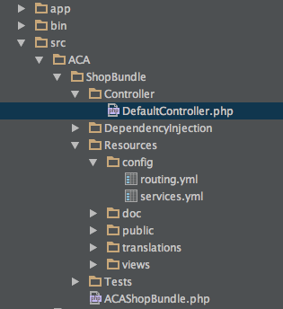

Introduction to Symfony
=======================
>Now that we are comfortable with OOP and some design patterns, we will start learning about the [Symfony](http://symfony.com/) web framework.
>Symfony is fast, easy to set up, supports Composer, MVC, Front Controller, complex routing, YML Configuration, Service Container, Dependency Injection etc... all things we have come to expect of a modern and well documented framework.

***

### Installation
In order to install the framework we are going to need to install composer first. 
[Composer](https://getcomposer.org/) is a dependency manager that we will be using to download [Symfony](http://symfony.com).

#### Install composer
On your local machine, type in these commands.
```bash
curl -sS https://getcomposer.org/installer | php
mv composer.phar /usr/local/bin/composer
```
At this point you will need to close your terminal and open it up again, then type ```composer```

#### Install Symfony using composer
Symfony can be downloaded and unarchived in the current folder, or you can just use composer to install it. 
```bash
cd /var/www
composer create-project symfony/framework-standard-edition acashop/
```
You will be asked ```Would you like to install Acme demo bundle? [y/N]``` Say ```n```, 
you will then be asked a bunch of other questions, just keep hitting enter till they all go away.

Once everything is done, you will have a newly created folder called ```acashop```.
```bash
cd acashop
```

#### Using Symfony's console
Symfony has a CLI application called ```console```. It is located in the ```app``` folder.
```bash
php app/console
```
As you can see the console is a full featured CLI application that allows us to do many things. One of the first things we are interested in doing is creating a ```bundle``` 
You can think of a bundle as being a unit of code, and configuration that contains an application that lives within the Symfony framework. 

#### Create our bundle
We are going to create a bundle that will contain all the routes and code for our application *ACAShop*
```bash
php app/console generate:bundle
```

You will then be directed to answer a series of questions:
- Bundle namespace: ```ACA\ShopBundle```
- Bundle name [ACAShopBundle]: ```Hit enter```
- Target directory [/var/www/acashop/src]: ```Hit enter```
- Configuration format (yml, xml, php, or annotation): ```yml```
- Do you want to generate the whole directory structure [no]? ```yes```
- Do you confirm generation [yes]? ```Hit enter```
- Confirm automatic update of your Kernel [yes]? ```Hit enter```
- Confirm automatic update of the Routing [yes]? ``Hit enter```

Once you are done with this, your directory should look like this:



#### Routing
Any website that you visit will have a home page and some other pages that may be static content or contain some interface that you can interact with. 
The various pages on a website can be accessed by ```routes```. Routing is the process of creating such routes.

Open up your browser and view our newly created site by visiting [http://10.10.10.10/acashop/web/app_dev.php](http://10.10.10.10/acashop/web/app_dev.php) 
we should get an error message that reads *No route found for "GET /"* 
The reason why this is happening is because we have not defined any routes just yet. The first thing we will be doing is defining a route for the home page. 

Open up a file called ```src/ACA/ShopBundle/Resources/config/routing.yml``` in your IDE. 


This file should contain the following yml config
```yml
aca_shop_homepage:
    path:     /hello/{name}
    defaults: { _controller: ACAShopBundle:Default:index }
```

Rename the first line that reads ```path: /hello/{name}``` to ```path: /``` 
This means that we want the route to match ```/``` i.e. the home page. 
The next line ```defaults``` is the corresponding controller and method that the route hits. 
So, in this example we are in the ```ACAShopBundle```, under the ```DefaultController``` and the method ```indexAction()```

#### Controllers
A controller is a class in the framework that contains code that gets executed when a matching route is found. 
Open up the file ```src/ACA/ShopBundle/Controller/DefaultController.php```



Get rid of the code for the indexAction() method
```php
public function indexAction($name)
{
    return $this->render('ACAShopBundle:Default:index.html.twig', array('name' => $name));
}
```

Replace it with this 
```php
public function indexAction()
{
    return $this->render('ACAShopBundle:Default:index.html.twig');
}
```

What we did is removed the $name parameter as an argument, from the method and the template.

#### Templating
Symfony uses a templating engine called twig. Twig templates are located in the views folder in your bundle. 
The views folder should contain a sub-folder called ```Default```. The folder name should match the controller name, 
so ```DefaultController```'s templates will live in ```/src/ACA/ShopBundle/Resources/views/Default/```

Open the file ```index.html.twig``` located in the views folder, and replace its contents with 
```html
<h3>Welcome to ACAShop</h3>
```

Now lets visit the site [http://10.10.10.10/acashop/web/app_dev.php](http://10.10.10.10/acashop/web/app_dev.php), we should see the message we just entered. 

You might be wondering why we took all this trouble just to get that one message on there when you could have done the exact same thing with plain PHP. 
Symfony gives us a framework that we can use to develop a fully featured PHP application, while you could certainly achieve the same effect in PHP, 
as you will learn, using a framework is a huge time saver. As we mentioned earlier, using MVC separation is the hallmark of modern web applications. 
If you were to write your application in pure PHP you would have to spend time to create a router, controller, autoloader, templating engine etc...

#### PSR-4 autoloading
Symfony supports [PSR-4](http://www.php-fig.org/psr/psr-4/) [autoloading](http://us3.php.net/autoload) autoloading for all your classes.  
In the days of yore, every file that you wanted to be a part of your project needed to have either an ```include```, ```require``` or ```require_once``` declaration prior to it's use. 
Autoloading solves this problem by giving you the ```spl_autoload_register``` method that you can use to register an autoloader, or any number of autoloaders.

Here is an example of how to use it
```php
function myCustomAutoloader($class) {
    include 'classes/' . $class . '.class.php';
}

spl_autoload_register('myCustomAutoloader');

// Or, using an anonymous function as of PHP 5.3.0
spl_autoload_register(function ($class) {
    include 'classes/' . $class . '.class.php';
});
```

#### Namespaces
It is generally a good practice to namespace your code. 
Put your code in a specific folder structure, use the ```namespace``` keyword to mark it a part of that namespace. 
e.g. My class is located in the folder **ACA/ShopBundle/Shop/Product.php** then here is what the namespace declaration would look like. 
```php
<?php
namespace ACA\ShopBundle\Shop;

class Product
{
    // ...
}
```

If you want to use this class in some other namespace, simply use the ```use``` keyword followed by the fully qualified namespace including the class name.
```php
<?php
namespace Foo\Young\SoupBundle\Employee;

use ACA\ShopBundle\Shop\Product;

class DoMoWerk{
    
    public function __construct(){
        $Product = new Product();
        $Product->setType('soup');
    }
}
```

#### Dependency Injection
As a concept, DI is quite simple. Instead of creating the dependencies a class needs from within itself, you provide the dependency from the outside. 
If you pass in dependencies via arguments, you can easily swap those out with other test objects or even test values without mutating the fundamental nature of your classes. 
Alas, in the field, this concept is sometimes taken too far, trading readability for testability, which, in my opinion, is a deal breaker!   

Lets look at an example of a class with constructor dependency injection and the same class without it.
```php
<?php

/**
 * Class WithDI illustrates a class with dependencies that have been injected
 */
class WithDI
{
    /**
     * Database connection
     *
     * @var DBCommon
     */
    protected $DB;

    /**
     * User placing an order
     *
     * @var ACAPerson
     */
    protected $User;

    /**
     * Order object containing the user's entire order
     *
     * @var ACAOrder
     */
    protected $Order;

    public function __construct(DBCommon $DB, ACAPerson $User, ACAOrder $Order)
    {
        $this->DB = $DB;
        $this->User = $User;
        $this->Order = $Order;
    }
}


/**
 * Class WithoutDI illustrates a class with the ability for itself to fetch it's own dependencies.
 */
class WithoutDI
{
    /**
     * Database connection
     *
     * @var DBCommon
     */
    protected $DB;

    /**
     * User placing an order
     *
     * @var ACAPerson
     */
    protected $User;

    /**
     * Order object containing the user's entire order
     *
     * @var ACAOrder
     */
    protected $Order;

    public function __construct($userId, $orderId)
    {
        $this->DB = Factory::getDB();
        $this->User = Factory::getACAPerson($userId);
        $this->Order = Factory::getACAOrder($orderId);
    }
}
```

#### Service Container
You may be wondering where the class ```WithDI``` gets it's constructor arguments from? In other words who gives each class the dependencies it needs?
Meet the [Service Container](http://symfony.com/doc/current/book/service_container.html), whose main task is to standardize and centralize the creation of objects in your system.