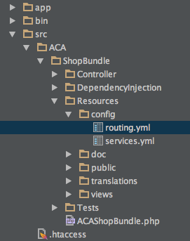

Introduction to Symfony
=======================
>Now that we are comfortable with OOP and some design patterns, we will start learning about the [Symfony](http://symfony.com/)` web framework.
>The reason why we are looking at this framework instead of another is because it's modern and has all the features we could ever need. 
>It's fast, easy to set up, supports Composer, MVC, Front Controller, YML Configuration, Service Container, Dependency Injection etc...

***

### Installation
In order to install the framework we are going to need to install composer first. 
[Composer](https://getcomposer.org/) is a dependency manager that we will be using to download [Symfony](http://symfony.com).

#### Install composer
```bash
curl -sS https://getcomposer.org/installer | php
sudo mv composer.phar /usr/local/bin/composer
```
At this point you will need to close your terminal and open it up again, then type ```composer```

#### Install Symfony using composer
Symfony can be downloaded and unarchived in the current folder, or you can just use composer to install it. 
```bash
cd /var/www
composer create-project symfony/framework-standard-edition acashop/
```
You will be asked ```Would you like to install Acme demo bundle? [y/N]``` Say ```n```, 
you will then be asked a bunch of other questions, just keep hitting enter till they all go away.

Once everything is done, you will have a newly created folder called ```acashop```.
```bash
cd acashop
```

#### Using Symfony's console
Symfony has a CLI application called ```console```. It is located in the ```app``` folder.
```bash
php app/console
```
As you can see the console is a full featured CLI application that allows us to do many things. One of the first things we are interested in doing is creating a ```bundle``` 
You can think of a bundle as being a unit of code, and configuration that contains an application that lives within the Symfony framework. 

#### Create our bundle
We are going to create a bundle that will contain all the routes and code for our application *ACAShop*
```bash
php app/console generate:bundle
```

You will then be directed to answer a series of questions:
- Bundle namespace: ```ACA\ShopBundle```
- Bundle name [ACAShopBundle]: ```Hit enter```
- Target directory [/var/www/acashop/src]: ```Hit enter```
- Configuration format (yml, xml, php, or annotation): ```yml```
- Do you want to generate the whole directory structure [no]? ```yes```
- Do you confirm generation [yes]? ```Hit enter```
- Confirm automatic update of your Kernel [yes]? ```Hit enter```
- Confirm automatic update of the Routing [yes]? ``Hit enter```

Once you are done with this, your directory should look like this:


#### Routing
Any website that you visit will have a home page and some other pages that may be static content or contain some interface that you can interact with. 
The various pages on a website can be accessed by ```routes```. Routing is the process of creating such routes.

Open up your browser and view our newly created site by visiting [http://10.10.10.10/acashop/web/app_dev.php](http://10.10.10.10/acashop/web/app_dev.php) 
we should get an error message that reads *No route found for "GET /"* 
The reason why this is happening is because we have not defined any routes just yet. The first thing we will be doing is defining a route for the home page. 

Open up a file called ```src/ACA/ShopBundle/Resources/config/routing.yml``` in your IDE. 



This file should contain the following yml config
```yml
aca_shop_homepage:
    path:     /hello/{name}
    defaults: { _controller: ACAShopBundle:Default:index }
```

Rename the first line that reads ```path: /hello/{name}``` to ```path: /``` 
This means that we want the route to match ```/``` i.e. the home page. 
The next line ```defaults``` is the corresponding controller and method that the route hits. 
So, in this example we are in the ```ACAShopBundle```, under the ```DefaultController``` and the method ```indexAction()```

#### Controllers
A controller is a class in the framework that contains code that gets executed when a matching route is found. 
Open up the file ```src/ACA/ShopBundle/Controller/DefaultController.php```


Get rid of the code for the indexAction() method
```php
public function indexAction($name)
{
    return $this->render('ACAShopBundle:Default:index.html.twig', array('name' => $name));
}
```

Replace it with this 
```php
public function indexAction(){
    return $this->render('ACAShopBundle:Default:index.html.twig');
}
```

What we did is removed the $name parameter as an argument, from the method and the template.

#### Templating
Symfony uses a templating engine called twig. Twig templates are located in the views folder in your bundle. 
The views folder should contain a sub-folder called ```Default```. The folder name should match the controller name, 
so ```DefaultController```'s templates will live in ```/src/ACA/ShopBundle/Resources/views/Default/```

Open the file ```index.html.twig``` located in the views folder, and replace its contents with 
```html
<h3>Welcome to ACAShop</h3>
```

Now lets visit the site [http://10.10.10.10/acashop/web/app_dev.php](http://10.10.10.10/acashop/web/app_dev.php), we should see the message we just entered. 

You might be wondering why we took all this trouble just to get that one message on there when you could have done the exact same thing with plain PHP. 
Symfony gives us a framework that we can use to develop a fully featured PHP application, while you could certainly achieve the same effect in PHP, 
as you will learn, using a framework is a huge time saver. Our goal is to create a basic E-Commerce application.

* Creating controller actions
* Templating using twig
* PSR4 autoloading and namespacing conventions
* Dependency Injection
* MVC architecture

### Databases
* MySQL primer on SELECT, INSERT, UPDATE, DELETE queries
* Specifying criteria with WHERE clause
* Fetching related data using JOIN
* Limiting the number of results returned 
* Creating a custom database helper class
