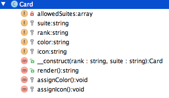
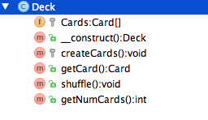
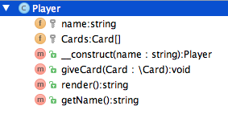

In the second week of class, we wrote some helper functions for our teammates, who were working on a card game.
 
We created the following functions:
- ```getDeck()``` - Returns an array of cards in a deck
- ```shuffleDeck(&$deck)``` - Shuffle a deck of cards
- ```deal($players, $numCards, &$shuffledDeck)``` - Deal a certain number of cards out to each player from the given deck

Now that we have a solid understanding of how classes and objects work, we are being asked to create classes out of this functionality. 

By creating classes, we will allow for this functionality to be dropped into a wider system with ease,  
make it flexible to test and make it perfectly clear to our colleagues how our classes are supposed to work.

Here are the classes you are being asked to create:

##### Card
This class represents a single playing card



##### Deck
This class represents a deck of cards. 
You should be able to shuffle the deck, get a card from the deck and count the number of remaining cards, once some have been dealt.



##### Player
This class represents a player playing this game. The player should have a name, and a hand of cards



The starter code provides an example of an ```index.php``` file that instantiates the classes into objects and calls the appropriate methods. 
Please use this code as your guide and breathe life into the empty methods

#### Card.php
```php
<?php

/**
 * Class Card represents a single playing card
 */
class Card
{
    /**
     * Allowed suite characters
     * @var array
     */
    private $allowedSuites = array('D', 'H', 'S', 'C');

    /**
     * Suite of card
     * e.g D, H, S, C
     *
     * @var string
     */
    protected $suite;

    /**
     * Rank of card
     * e.g. A, 2, 3..... J, K Q
     *
     * @var string
     */
    protected $rank;

    /**
     * Color of this card, depending on the suite
     * Spades and Clubs are black while Hearts and Diamonds are red
     * @var string
     */
    protected $color;

    /**
     * HTML entity iconic representation of this suite
     * @var string
     */
    protected $icon;

    /**
     * @param string $rank Rank of this card
     * @param string $suite Single character suite of this card
     * @throws Exception
     */
    public function __construct($rank, $suite)
    {
        // Ensure that the suite the client passed in is a valid one
        if (!in_array($suite, $this->allowedSuites)) {
            throw new Exception('Cannot create a card because suite, ' . $suite . ', is invalid!');
        }

        // Assign them to the local object properties
        $this->rank = $rank;
        $this->suite = $suite;

        // Color this card
        $this->assignColor();

        // Give it an icon
        $this->assignIcon();
    }

    /**
     * Get an HTML rendering for this card
     * @return string
     */
    public function render()
    {
    }

    /**
     * Assign the appropriate color to this card
     * @return void
     */
    protected function assignColor()
    {
    }

    /**
     * Assign the appropriate HTML entity icon to this card
     * @return void
     */
    protected function assignIcon()
    {
    }
}
```

#### Deck.php
```php
<?php

/**
 * Class Deck represents a deck of cards and some common operations around a deck
 */
class Deck
{
    /**
     * Array of shuffled cards
     * @var Card[]
     */
    protected $Cards = array();

    /**
     * Create a deck and shuffle it
     */
    public function __construct()
    {
        // Create all cards in this deck
        $this->createCards();

        // Shuffle all the cards to begin with
        $this->shuffle();
    }

    /**
     * Create all the necessary cards
     * @return void
     */
    protected function createCards()
    {
        $suites = array('D', 'H', 'S', 'C');
        $ranks = array_merge(array('A'), range(2, 10), array('J', 'Q', 'K'));

    }

    /**
     * Get a random card from the deck, make sure that the card you get is not in the deck anymore
     * @return Card
     */
    public function getCard()
    {
    }

    /**
     * Shuffle all cards in the deck
     * @return void
     */
    public function shuffle()
    {
    }

    /**
     * How many cards are in this deck?
     * @return int
     */
    public function getNumCards()
    {
    }
}
```

#### Player.php
```php
<?php

/**
 * Class Player represents one player playing a game
 */
class Player
{
    /**
     * Player name
     * @var string
     */
    protected $name;

    /**
     * Cards this player has been dealt
     * @var Card[]
     */
    protected $Cards = array();

    /**
     * @param string $name Player's full name
     */
    public function __construct($name)
    {
        $this->name = $name;
    }

    /**
     * Give this player a card
     * @param Card $Card
     */
    public function giveCard(Card $Card)
    {
        $this->Cards[] = $Card;
    }

    /**
     * Render this player's cards for the browser
     * @return string
     */
    public function render()
    {
        $return = null;

        if (empty($this->Cards)) {

            $return .= 'No Cards';

        } else {

            foreach ($this->Cards as $Card) {

                $return .= $Card->render().' ';
            }
        }
        return $return;
    }

    /**
     * @return string
     */
    public function getName()
    {
        return $this->name;
    }
}
```

#### index.php
```php
<?php

// Create a deck and shuffle it
$Deck = new Deck();
$Deck->shuffle();

// Create two new players
$PlayerBob = new Player('Bob');
$PlayerSue = new Player('Sue');

// Give bob 3 cards
$PlayerBob->giveCard($Deck->getCard());
$PlayerBob->giveCard($Deck->getCard());
$PlayerBob->giveCard($Deck->getCard());

// Give sue 3 cards
$PlayerSue->giveCard($Deck->getCard());
$PlayerSue->giveCard($Deck->getCard());
$PlayerSue->giveCard($Deck->getCard());

// Show all the cards each player has been dealt
echo '<h3>'.$PlayerBob->getName().'</h3>';
echo $PlayerBob->render();
echo '<br/>';
echo '<h3>'.$PlayerSue->getName().'</h3>';
echo $PlayerSue->render();
echo '<br/>';
echo 'Number of cards remaining in the deck: '.$Deck->getNumCards();
```