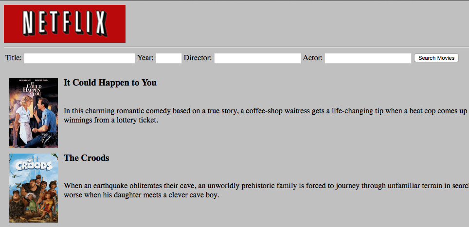

#### Homework 05 - Neflix movie search engine

In this fun homework example, we are going to create an app that will allow our uses to search movies on Netflix. 
This is how it could end up looking...

 
The goal is to create a class called ```NetflixSearch``` that will perform this task. 

This is the API URL you will be using
```
http://netflixroulette.net/api/api.php
```

Following are currently supported search parameters. Be sure to create getters/setters for each of these.

##### Optional Parameters
- title (string)
- year (number)
- director (string)
- actor (string)

##### Validation and Hints
- Make sure at least one of these parameters have been provided by the user 
- Ensure that year, if provided, is numeric 
- Throw an ```Exception``` if an error is encountered with validation
- Investigate the use of ```http_build_query()``` and think about how and why you would want to use it
- You will also need to acquire a package to make HTTP requests and process responses, guzzle is a great tool for this job
 
##### Client
The client is typically the consumer of your class, a.k.a the code that will use the code that you have written. 
 
- Create a HTML form that accepts values for title, year, director and actor.
- You will then need some HTML to render the results in a tabular fashion
- It is the client's responsibility to catch and handle any errors that may occur
- Make sure that you encode user input correctly using ```urlencode()```

##### Example usage
```php
$search = new NetflixSearch();
$search->setActor($_POST['actor']);
...

$results = $search->performSearch();
...

```

##### Package requirements
- Create a composer.json file
- Indicate guzzle as a dependency
- Install packages
- Reference vendor/autoload.php file in your client code