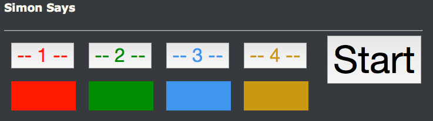

#### Homework 05 - Simon Says Game

We have been asked to create a web based implementation of simon says. We will be creating 4 buttons on a web page, numbered 1-4. 
Each button will have a different colored div underneath it.



Here is a scenario on how the game will be played:
 - The user clicks on the start button to start the game, at which time the colored lights disappear
 - The user will click on one button, and the first light will flash
 - The user then clicks on third button, and the first and third light will flash
 - The user then clicks on the second button and the first, third and second lights flash....
 - This process will continue until the user makes a mistake
 
In short, each successive round will play back the results from the prior round, until the user makes a mistake in the sequence. 
If the user makes a mistake in the sequence, display the number of rounds they were able to play and the total time they took to play the game.


```html
<html>
<head>
<link rel="stylesheet" href="style.css"/>
<script src="//ajax.googleapis.com/ajax/libs/jquery/2.1.4/jquery.min.js"></script>

<script type="text/javascript" language="JavaScript">
    $(document).ready(function(){

        console.log('The document is ready...');
    });
</script>
</head>
<body>

    <h3>Simon Says</h3>

    <hr style="width:50%; float: left;"/>
    <div style="clear:both;"></div>


    <div class="container">

        <!-- Div containing table of buttons and lights -->
        <div style="float:left;">
        
            <table cellpadding="10">

                <!-- Row for buttons -->
                <tr>
                    <td>
                        <button id="btn-1" class="btn-simon">-- 1 --</button>
                    </td>
                    <td>
                        <button id="btn-2" class="btn-simon">-- 2 --</button>
                    </td>
                    <td>
                        <button id="btn-3" class="btn-simon">-- 3 --</button>
                    </td>
                    <td>
                        <button id="btn-4" class="btn-simon">-- 4 --</button>
                    </td>
                </tr>

                <!-- Row for colors -->
                <tr>
                    <td>
                        <div id="div-1" class="div-simon"></div>
                    </td>
                    <td>
                        <div id="div-2" class="div-simon"></div>
                    </td>
                    <td>
                        <div id="div-3" class="div-simon"></div>
                    </td>
                    <td>
                        <div id="div-4" class="div-simon"></div>
                    </td>
                </tr>
            </table>
            
        </div>

        <!-- Div containing the giant start button -->
        <div style="float:left; padding-left:20px;">
            <button class="btn-start">Start</button>
        </div>

    </div>

</body>
</html>
```

##### Thinking about the problem
Firstly, you will need to acquire user input from each of the button clicks using jQuery. 

Using javascript, you can select all the buttons that have the class ```btn-simon``` and attach a ```click``` event handler to them.
```javascript
$('.btn-simon').on('click', function(){
    var id = $(this).attr('id');
    console.log('The button you clicked is: ' + id);
});
```

Now that you know which button was fired, you need to send the data off to a server side PHP script that will record the results. 
Lets assume that you have two PHP scripts, one called ```record.php``` and the other called ```playback.php```. 
```record.php``` will record the button that the user pressed, and add it to the end of an array that contains all the answers thus far. 
The answers array can be stored in a PHP session using the ```$_SESSION``` superglobal.
 
Here is an example of a javascript function that makes an AJAX call to a remote PHP script, and record which button was pressed. 
```javascript
/**
 * Record which button was pressed
 * @param id {String} HTML Id for the button that was pressed
 */
function recordButtonPress(id) {
    $.post('record.php',
            {
                buttonId: id
            },
            function (jsonResponse) {
                console.log('Response from server...');
                console.log(jsonResponse);
            }, "json"
    );
}
```

So far most of the work we have done is on the client side. On the server side, we will be using the current session to record user input.
Here is an example of what your ```record.php``` script would look like.
 
```php
<?php

// Allow PHP to use sessions with this script
session_start();

// Acquire the buttonId from the AJAX call made using JS
$buttonId = $_POST['buttonId'];

// Do we have existing responses?
if(isset($_SESSION['responses']) && !empty($_SESSION['responses'])){

    // Push the new response to the end of responses
    array_push($_SESSION['responses'], $buttonId);

}else{

    // We don't have any responses, let's create the first one
    $_SESSION['responses'] = array($buttonId);
}
```